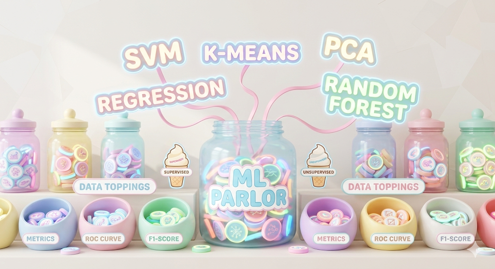

# 3. ML Algorithms

---

## icon: lucide/vault

# Linear Regression

## Fundamentals of Linear Regression

At its core, **linear regression** is about modeling relationships. Imagine you want to predict someone’s weight from their height. Intuitively, taller people tend to weigh more. Linear regression takes this kind of intuition and expresses it in the form of a mathematical equation that describes a straight-line relationship between input variables (features) and an output variable (target).

### Simple Linear Regression

The simplest form is **simple linear regression**, where we have one feature and one target. The equation looks like this:

$$y = \beta_0 + \beta_1x + \epsilon$$

* **$y$**: The target we want to predict.
* **$x$**: The input feature.
* **$\beta_0$**: The intercept (the value of $y$ when $x=0$).
* **$\beta_1$**: The slope (how much $y$ changes when $x$ increases by 1 unit).
* **$\epsilon$**: The error term (the part of $y$ not explained by the model).

### Multiple Linear Regression

In most real-world situations, we deal with more than one input variable. The equation generalizes to:

$$y = \beta_0 + \beta_1x_1 + \beta_2x_2 + \dots + \beta_nx_n + \epsilon$$

Now, instead of fitting a straight line, we are fitting a **hyperplane** in an $n$-dimensional space. Each coefficient $\beta_i$ represents the contribution of a specific feature to the target, while keeping other features constant.

---

## Assumptions of Linear Regression

Linear regression is elegant, but it relies on specific assumptions to ensure the model’s predictions and interpretations are reliable.

| Assumption | Description | How to Test | Fixes if Violated |
| --- | --- | --- | --- |
| **Linearity** | Relationship between features and target must be linear. | Residuals vs. Predicted plot (should be random scatter). | Log/Square root transforms, polynomial features. |
| **Independence** | Errors for one data point should not correlate with another. | **Durbin-Watson test** (values near 2 are good). | Time-series models (ARIMA), add lag variables. |
| **Homoscedasticity** | Constant variance of errors across all levels of $y$. | Residuals vs. Predicted plot (look for a "funnel" shape). | Transform target variable (log), Weighted Least Squares. |
| **Normality** | Residuals should follow a normal distribution. | **Q–Q plot** (should follow a diagonal line) or Shapiro-Wilk. | Transformations or non-parametric methods. |
| **No Multicollinearity** | Features should not be highly correlated with each other. | **Variance Inflation Factor (VIF)** > 5 or 10. | Remove a feature, combine features, or use Ridge/Lasso. |

---

## How Linear Regression is Optimized

The goal of optimization is to find the best values for the coefficients $\beta$ by minimizing a **cost function**. The most common method is **Ordinary Least Squares (OLS)**, which minimizes the **Sum of Squared Residuals (SSR)**:

$$J(\beta) = \sum_{i=1}^{n} (y_i - \hat{y}_i)^2$$

### 1. Analytical Solution (Closed-Form)

For small datasets, we can directly compute the optimal coefficients using linear algebra:

$$\hat{\beta} = (X^T X)^{-1} X^T y$$

> **Note:** The matrix inversion $(X^T X)^{-1}$ becomes computationally expensive as the number of features grows.

### 2. Gradient Descent (Iterative Solution)

For larger datasets, gradient descent takes small steps in the direction that reduces the cost function most. The update rule is:

$$\beta_j := \beta_j - \alpha \frac{\partial}{\partial \beta_j} J(\beta)$$

* **$\alpha$ (Learning Rate):** Controls the step size. If too large, it may overshoot; if too small, it converges slowly.

---

## Evaluation Metrics

| Metric | Formula | Best Use Case |
| --- | --- | --- |
| **MSE** (Mean Squared Error) | $\frac{1}{n} \sum (y_i - \hat{y}_i)^2$ | When you want to penalize large errors heavily. |
| **RMSE** (Root MSE) | $\sqrt{MSE}$ | When you want the error in the same units as the target. |
| **MAE** (Mean Absolute Error) | $\frac{1}{n} \sum | y_i - \hat{y}_i |
| **$R^2$** | $1 - \frac{SS_{res}}{SS_{tot}}$ | To explain the proportion of variance captured by the model. |
| **Adjusted $R^2$** | $1 - \frac{(1-R^2)(n-1)}{n-p-1}$ | To compare models with different numbers of features fairly. |

---

## Practical Tips and Pitfalls

* **Feature Scaling:** Essential when using **regularization** (Ridge/Lasso). Standardize features so one doesn't dominate the penalty term.
* **The Dummy Variable Trap:** When one-hot encoding categorical variables, always drop one category (e.g., $N-1$ columns) to avoid perfect multicollinearity.
* **Regularization:**
* **Ridge ($L_2$):** Adds $\lambda \sum \beta_j^2$. Shrinks coefficients; good for multicollinearity.
* **Lasso ($L_1$):** Adds $\lambda \sum |\beta_j|$. Can drive coefficients to zero; useful for **feature selection**.

* **Outliers:** Linear regression is sensitive to outliers because of the squaring of errors. Always check your residuals.

Would you like me to create a Python code snippet demonstrating how to check for these assumptions using `scikit-learn` and `statsmodels`?

