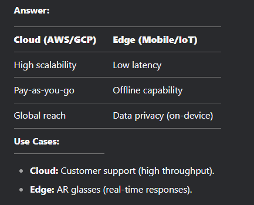

# 2. LLM Interview Questions

## 🏗️ Core Architecture & RAG

### 1. What is LLM System Design, and why is it important?

**Answer:** LLM System Design refers to the end-to-end architecture for deploying large language models in production. It encompasses:

* **Infrastructure:** Hardware (GPU/TPU), cloud providers, and optimization.
* **Inference Pipelines:** Latency reduction, caching, and batching strategies.
* **Integration:** APIs, Retrieval-Augmented Generation (RAG), and safety guardrails.
* **Scalability:** Managing high traffic while balancing cost-performance trade-offs.

**Importance:** Without robust design, LLMs suffer from high latency, "hallucinations," security vulnerabilities, and unsustainable operational costs.

### 2. Explain Retrieval-Augmented Generation (RAG).

**Answer:** RAG enhances LLM outputs by fetching external, real-time data to ground responses in facts.

* **The Workflow:**
1. **Embed:** Convert user query into a vector (e.g., via `SentenceTransformers`).
2. **Retrieve:** Find top-k relevant document chunks from a Vector DB (e.g., Pinecone, Milvus).
3. **Augment:** Insert those chunks into the prompt as "context."
4. **Generate:** The LLM answers based strictly on the provided context.

* **Benefits:** Reduces hallucinations, provides a clear audit trail (citations), and allows for "updating" model knowledge without expensive retraining.

---

## ⚡ Performance Optimization

### 3. How do you optimize for low latency and high throughput?

**Answer:**

* **Quantization:** Reducing weight precision (e.g., FP16 to INT8 or 4-bit) to save VRAM and speed up compute.
* **KV Caching:** Storing previous "Key-Value" pairs in the attention mechanism to avoid recomputing the entire prompt prefix.
* **Speculative Decoding:** Using a tiny "draft" model to predict tokens, which are then verified in parallel by the large "target" model.
* **Continuous Batching:** Processing multiple requests simultaneously using frameworks like **vLLM** or **TGI**.

### 4. Compare Cloud vs. Edge Deployment.

| Feature | Cloud (e.g., AWS/GCP) | Edge (e.g., Mobile/Local Device) |
| --- | --- | --- |
| **Performance** | High-power GPUs; better for 70B+ models. | Limited by device RAM; suited for <7B models. |
| **Latency** | Network round-trip latency. | Near-instant (no network needed). |
| **Privacy** | Data travels to servers. | Data stays on-device (High Privacy). |
| **Cost** | Ongoing usage/token costs. | Zero marginal cost after deployment. |

---

## 🛠️ Reliability & Operations

### 5. Describe key Non-Functional Requirements (NFRs).

**Answer:**

* **Latency:** Aim for <200ms Time-To-First-Token (TTFT) for interactive chat.
* **Cost:** Implement "Model Cascading"—use GPT-4 for logic, but GPT-4o-mini or Mistral for classification.
* **Safety:** Use toxicity filters (Perspective API) and PII redaction (Presidio).
* **Observability:** Track **Perplexity** (model confidence) and **Token Usage** (budgeting).

### 6. How do you handle LLM Hallucinations?

**Answer:**

* **Self-Correction:** Ask the LLM to review its own response for factual errors.
* **N-Step Verification:** Use a second, smaller model to cross-reference the output against the retrieved RAG source.
* **Temperature Control:** Lowering `temperature` (e.g., to 0.1) makes the model more deterministic and less "creative."

---

## 💼 Product & Case Studies

### 7. Design Case Study: "Chat with PDF"

**Answer:**

* **Ingestion:** Parse PDFs using `Unstructured.io`; use recursive character splitting to create chunks (e.g., 512 tokens with 10% overlap).
* **Storage:** Store embeddings in a Vector DB like **ChromaDB** or **Weaviate**.
* **Retrieval:** Use **Hybrid Search** (combining Vector/Semantic search with Keyword/BM25 search) to find specific names or dates.
* **UX:** Implement **Streaming** (Server-Sent Events) so the user sees text as it generates rather than waiting 10 seconds.

### 8. How do you measure LLM ROI?

**Answer:**

* **Deflection Rate:** Percentage of support tickets resolved without human intervention.
* **Agent Assist:** Reduction in "Average Handle Time" (AHT) for human agents using LLM drafting tools.
* **Accuracy vs. Cost:** Measuring if a 10% increase in model accuracy justifies a 5x increase in API costs.

---

## 🛡️ Ethics & Safety

### 9. What are the ethical risks of LLM deployment?

**Answer:**

* **Bias:** Training data may reflect historical prejudices; requires "Red Teaming" to identify and mitigate.
* **Data Leakage:** Users might input sensitive company data into public models. **Solution:** Use VPC-isolated deployments or PII scrubbing.
* **Over-reliance:** Users treating the LLM as a source of truth for legal or medical advice. **Solution:** Hardcoded disclaimers and "human-in-the-loop" workflows.

---