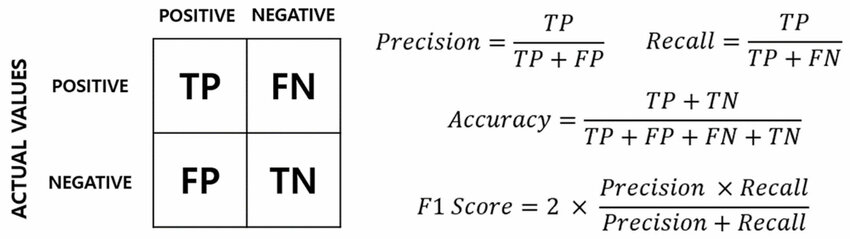
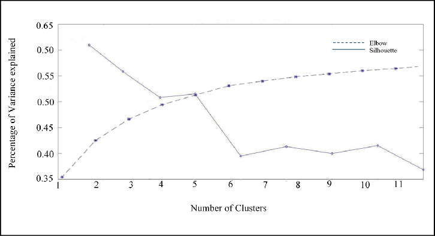
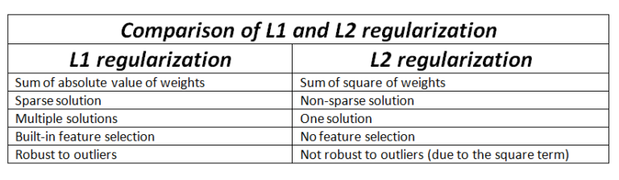
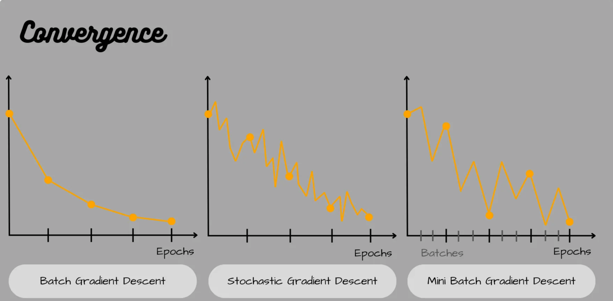

# 1. ML Interview Questions

### Easy (Questions 1-12)

### 1. Robinhood (Unbalanced Classes)

Say you are building a binary classifier for an imbalanced dataset (one class is much rarer than the other, say $1\%$ and $99\%$, respectively). How do you handle this?

**Solution:**

**Unbalanced classes** can be dealt with in several ways:

1. **Check for More Data:** You should first check whether you can get more data.
2. **Use Appropriate Metrics:** Ensure you're looking at appropriate performance metrics. **Accuracy is not a correct metric**. Instead, look at **precision, recall, F1 score, and the ROC curve**.
3. **Resample the Training Set:** You can resample by either **oversampling the rare samples** or **undersampling the abundant samples** (via bootstrapping).
4. **Generate Synthetic Examples:** Try generating synthetic examples, such as with **SMOTE (Synthetic Minority Over-sampling Technique)**.
5. **Ensemble Models:** Resample classes by running ensemble models with different ratios of the data.
6. **Adjust the Probability Threshold:** Adjust the classification threshold to something besides 0.5.
7. **Custom Cost Function:** Design a **cost function** that **penalizes wrong classification of the rare class more**.
8. Some Illustrations:

---

### 2. Square (MSE vs. MAE)

What are some differences you would expect in a model that **minimizes squared error** versus a model that **minimizes absolute error**? In which cases would each be appropriate?

**Solution:**

| **Feature** | **MSE (Mean Squared Error)** | **MAE (Mean Absolute Error)** |
| --- | --- | --- |
| **Error Weight** | **High weight given to large errors** (errors are squared). | Errors are linear. Less affected by extreme values. |
| **Outlier Robustness** | **Less robust** to outliers. | **More robust** to outliers. |
| **Computational Ease** | Easier to use (gradient is straightforward). | Gradient calculation is more complex. |
| **Minimizing Metric** | Minimized by the **conditional mean**. | Minimized by the **conditional median**. |

**Appropriate Use:** Use **MSE** if outliers are rare and you want to heavily penalize large errors. Use **MAE** if your data contains many outliers or you prefer the median as the central tendency.

---

### 3. Facebook (Choosing K for K-means)

When performing K-means clustering, how do you choose $K$?

**Solution:**

1. **The Elbow Method:**
    - **Metric:** **Within-Cluster Sum of Squared Errors (WSS/Inertia)**.
    - **Process:** Plot WSS versus $K$. Choose the value of $K$ where the decrease in WSS begins to slow significantly, forming an "elbow."
2. **The Silhouette Method:**
    - **Metric:** **Silhouette Coefficient**, measuring similarity to own cluster vs. others.
    - **Process:** Plot the average silhouette score versus K. The optimal K maximizes this score.
3. **Business Intuition:**
    - Consult with **subject matter experts** to leverage their knowledge regarding the expected number of groups.
    - **Visualize the features** for the different groups to assess their distinctness.
4. Illustrations:

---

### 4. Salesforce (Robustness to Outliers)

How can you make your models more **robust to outliers**?

**Solution:**

1. **Add Regularization:** Use **L1 or L2 regularization** to reduce variance.
2. **Try Different Models:** Use inherently robust models like **tree-based models** (Random Forests, Gradient Boosting).
3. **Winsorize Data:** **Cap the data** at arbitrary thresholds (e.g., set values outside the 5th and 95th percentiles to those percentile values).
4. **Transform Data:** Use a **log transformation** for right-skewed data.
5. **Change the Error Metric:** Use a more robust metric like **MAE** or **Huber loss** instead of MSE.
6. **Remove Outliers (Last Resort):** Only if you are certain they are true anomalies.
7. Illustration of L1 vs L2:

---

### 5. AQR (Correlated Predictors in Linear Regression)

Say that you are running a **multiple linear regression** and that you have found that several of the predictors are correlated. How will the results of the regression be affected if several are indeed correlated? How would you deal with this problem?

**Solution:**

**Problems (Multicollinearity):**

1. **Unstable and Insignificant Coefficients:** Coefficient estimates will vary dramatically, and confidence intervals may include 0.
2. **Misleading p-values:** An important variable might have a high p-value and be deemed insignificant. `A p-value is **the probability of observing results as extreme or more extreme than the actual results, assuming the null hypothesis (no effect or no difference) is true**.`

**How to Deal With It:**

- **Remove or Combine Predictors:** Remove one of the highly correlated predictors or combine them using **interaction terms**.
- **Data Preparation:** **Center the data** and try to obtain a **larger sample size**.
- **Regularization:** Apply methods such as **ridge regression** (L2 penalty).

---

### 6. Point72 (Motivation and Improvement of Random Forests)

Describe the motivation behind **Random Forests**. What are two ways in which they improve upon individual decision trees?

**Solution:**

**Motivation:** Individual decision trees are usually prone to **overfitting** (high variance). Random Forests (RFs) use an ensemble of trees to mitigate this issue.

**Two Main Ways RFs Improve:**

1. **Bootstrap Aggregation (Bagging):** Creates diversity by training each tree on a **resampled subset of the data**, leading to more consistent results (reduced variance).
2. **Feature Randomness at Each Split:** Uses a **random subset of features** at each split, which helps to **de-correlate the decision trees**.

---

### 7. PayPal (Dealing with Missing Data in Fraud Detection)

Given a large dataset of payment transactions, say we want to predict the chance of a given transaction being fraudulent. However, there are many rows with **missing values** in various columns. How would you deal with this?

**Solution:**

1. **Clarify the Missing Data:** Determine the type of data (MCAR, MAR, NMAR) and the volume of missingness.
2. **Establish a Baseline:** Build a model ignoring the missing data to see if it meets business goals.
3. **Impute Missing Data:**
    - **Simple:** Use **mean or median** for continuous features.
    - **Advanced:** Use a **Nearest Neighbors method** or a machine learning model to estimate missing values.
4. **Check Performance:** Cross-validate to check if imputation improves performance.
5. **Other Approaches:** Use **third-party datasets** or leverage models capable of handling missing data natively.

---

### 8. Airbnb (Improving Unsatisfactory Logistic Regression)

Say you are running a simple **logistic regression** to solve a problem but find the results to be unsatisfactory. What are some ways you might improve your model, or what other models might you look into using instead?

**Solution:**

**Ways to Improve Logistic Regression:**

1. **Feature Engineering and Scaling:** **Add additional features** (Logistic Regression is high bias) and **normalize features**.
2. **Data Quality and Selection:** Address outliers and select only the most useful variables.
3. **Model Tuning:** Use cross-validation and hyperparameter tuning, such as introducing **regularization** (L1 or L2).

**Alternative Models to Use:**

- If the classes are **not linearly separable**, switch to:
    - **Support Vector Machines (SVMs)**
    - **Tree-based approaches** (Random Forests, Gradient Boosting)
    - **Neural Networks**

---

### 9. The Sigma (Duplicated Data in Linear Regression)

Say you were running a linear regression for a dataset but you accidentally duplicated every data point. What happens to your beta coefficients?

**Solution:**

The **beta coefficients** (Beta) for the least squares estimator **remain unchanged**.

**Explanation:**

The formula for the least squares estimator is: **Beta = $(X'X)^-1 * X'Y$**.

When all data is duplicated, both X'X and X'Y are multiplied by a factor of 2.

Beta_new = $(2 * X'X)^-1 * (2 * X'Y) = 1/2 * (X'X)^-1 * 2 * (X'Y)$ = Beta_original

**Note:** The standard errors and confidence intervals will be incorrectly narrowed.

---

### 10. PwC (Gradient Boosting vs. Random Forests)

Compare and contrast, **gradient boosting** and **random forests**.

**Solution:**

| **Feature** | **Gradient Boosting (GB)** | **Random Forests (RF)** |
| --- | --- | --- |
| **Tree Building** | **Sequential/Additive:** Each tree corrects the mistakes (residuals) of the preceding one. | **Parallel/Independent:** Trees are built independently. |
| **Final Output** | Combined sequentially after each iteration. | Combined at the end (averaging/majority voting). |
| **Overfitting Risk** | **More prone to overfitting**. | **Less prone to overfitting**. |
| **Training Time** | Slower (sequential). | Faster (parallel). |

---

### 11. DoorDash (Data Sufficiency for ETA Model)

Say that DoorDash is launching in Singapore. For this new market, you want to predict the estimated time of arrival (ETA) for a delivery. From an earlier beta test in Singapore, there were 10,000 deliveries made. **Do you have enough training data** to create an accurate ETA model?

**Solution:**

1. **Clarify What "Good" ETA Means:** Define the required accuracy based on the prediction's use and its business impact.
2. **Assess Baseline Performance:** Train a simple baseline model on the 10,000 deliveries and evaluate it using metrics like **RMSE or MAE**.
3. **Determine Data Needs via Learning Curves:** Build **learning curves** (accuracy vs. amount of training data). If the curve is still rising sharply, more data is needed. If it has flattened, focus on feature engineering or a different model.
4. **If Insufficient Data:** Look into **feature expansion** or using models that perform well with less data.

---

### 12. Affirm (Explaining Loan Rejections Without Feature Weights)

Say we are running a binary classification loan model, and rejected applicants must be supplied with a reason why they were rejected. Without digging into the weights of features, how would you supply these re1asons?

**Solution:**

The primary technique is using **Partial Dependence Plots (PDPs)** combined with **Counterfactual Reasoning**.

1. **Partial Dependence Plots (PDPs):** PDPs show the **marginal effect of a single feature on the predicted outcome** (rejection probability) while holding all other features constant.
2. **Counterfactual Reasoning:** Compare a rejected applicant's profile to a very similar accepted profile (ceteris paribus) to isolate the cause (e.g., "Lower FICO Score").

---

---

### Medium (Questions 13 - 25)

### 13. Google (Identify Synonyms)

Say you are given a very large corpus of words. How would you identify synonyms?

**Solution:**

To find synonyms, we can use **word embeddings** (like **Word2Vec**), which produce vectors for words based on their context.

1. **Generate Word Embeddings:** Create vectors where words closer in Euclidean distance are closer in meaning.
2. **Measure Similarity:** The similarity between these vectors is measured using **cosine similarity**.
3. **Find Synonyms:** Use **K-means clustering** or a **K-Nearest Neighbors (kNN)** algorithm to find the closest vector neighbors for a word.

**Edge Case:** Word embeddings can sometimes find similar vectors for **antonyms** (e.g., "hot" and "cold") because they appear in similar contexts.

---

### 14. Facebook (Bias-Variance Trade-off)

What is the **bias-variance trade-off**? How is it expressed using an equation?

**Solution:**

The trade-off describes the conflict in simultaneously minimizing two sources of error:

- **Bias:** Error from a model **underfitting** data (too simple).
- **Variance:** Error from a model **overfitting** data (too sensitive to noise).

The trade-off is expressed by the **Total Model Error** equation:

**Total Model Error = $Bias^2 + Variance + Irreducible Error$**

The goal is to find a balance to minimize both bias and variance for good generalization.

---

### 15. Uber (Cross-Validation)

Define the **cross-validation process**. What is the motivation behind using it?

**Solution:**

**Cross-validation** (e.g., K-Fold) is a technique to estimate a model's performance on independent data samples.

- **Process:** The dataset is split into $K$ folds. The model is trained on $K-1$ folds and validated on the remaining fold, repeating $K$ times, and the results are averaged.
- **Motivation:**
    1. **Avoid Overfitting:** It prevents training and testing on the same data.
    2. **Efficient Data Usage:** It ensures every data point is used for both training and validation, which is crucial for smaller datasets.

---

### 16. Salesforce (Lead Scoring Algorithm)

How would you build a **lead scoring algorithm** to predict whether a prospective company is likely to convert into being an enterprise customer?

**Solution:**

The goal is to build a binary classifier to predict conversion probability.

1. **Features (Inputs):** Include **Firmographic Data** (revenue, employee count), **Marketing Activity** (clicks, downloads), **Sales Activity** (meetings), and **Deal Details**.
2. **Models (Classifier):**
    - **Logistic Regression:** Simple, interpretable, but limited complexity.
    - **Tree-Based Models (XGBoost, RF):** A strong compromise, offering good performance and feature-importance interpretability.
3. **Deployment:** Monitor for **feature shift and model degradation** and continuously update the model.

---

### 17. Spotify (Music Recommendation)

How would you approach creating a **music recommendation algorithm**?

**Solution:**

Use **Collaborative Filtering** with **Matrix Factorization**.

1. **Data Representation:** Create a **User-Song Matrix (R)** using **implicit feedback** (e.g., stream count) since explicit ratings are often unavailable.
2. **Matrix Factorization:** Decompose R into **User factors (P)** and **Song factors (Q)**: **R is approx P * Q'** (Q transpose). A common method is **Alternating Least Squares (ALS)**.
3. **Recommendation:** The dot product of a user vector and a song vector predicts relevance. Recommend unseen songs with the highest relevance score.

---

### 18. Amazon (Convexity)

Define what it means for a function to be **convex**. What is an example of a machine learning algorithm that is **not convex** and describe why that is so?

**Solution:**

**Convex Function Definition:**

A function $f$ is **convex** if the line segment connecting any two points on the function's graph lies entirely **on or above** the graph.

Mathematical Formula (Notion Compatible):

$f((1 - a) * x + a * y) <= (1 - a) * f(x) + a * f(y) where a is in [0, 1].$

- **Importance:** Convexity guarantees that any local minimum is also a **global minimum**.

**Non-Convex Example:**

- **Algorithm:** **Neural Networks** (specifically their loss function).
- **Reason:** Neural Networks are universal function approximators and can approximate non-convex functions. Their optimization surface contains many **local minima** and saddle points, meaning a local minimum is not guaranteed to be the global minimum, hence the loss function is non-convex.

---

### 19. Microsoft (Information Gain and Entropy)

Explain what **information gain** and **entropy** are in the context of a decision tree and walk through a numerical example.

**Solution:**

- **Entropy (H):** Quantifies the **impurity** or randomness of a set of samples. Higher entropy means a more mixed sample.
    - **Formula:** **Entropy = $- Sum [ P(Y=k) * Log2(P(Y=k)) ]$**
    - A perfectly homogeneous sample has an entropy of **0**.
- **Information Gain (IG):** Measures the **reduction in entropy** achieved after splitting the dataset on an attribute. Decision trees choose the split with the highest IG.
    - **Formula:**  $IG(X, Y) = H(Y) - H(Y | X)$

Numerical Example: (Pre-split Entropy $H(Y) = 1)$

If a split reduces the conditional entropy H(Y | X) to 0.39, the Information Gain is IG = 1 - 0.39 = 0.61.

---

### 20. Uber (L1 and L2 Regularization)

What is **L1 and L2 regularization**? What are the differences between the two?

**Solution:**

L1 and L2 penalization are regularization methods that prevent overfitting by adding a penalty term to the loss function, coercing coefficients towards zero.

| **Feature** | **L1 Regularization (Lasso)** | **L2 Regularization (Ridge)** |
| --- | --- | --- |
| **Penalty Term** | Sum of the **absolute values** of the coefficients. | Sum of the **squared magnitudes** of the coefficients. |
| **Effect** | Forces less important coefficients to become **exactly zero** (sparsity). | Forces coefficients towards zero, but **rarely makes them exactly zero**. |
| **Feature Selection** | **Performs inherent feature selection**. | **Does not perform feature selection**. |

---

### 21. Amazon (Gradient Descent)

Describe **gradient descent** and the motivations behind **stochastic gradient descent**.

**Solution:**

- **Gradient Descent (GD):** An iterative optimization algorithm that takes small steps proportional to the **negative gradient** (steepest descent) of the loss function to find its minimum.
    - **Update Rule:** **$x_t+1 = x_t - alpha * Gradient(f(x_t))$**
    - **Drawback (Batch GD):** Computationally intensive, as it uses the gradient of the loss over **all** data points in every iteration.
- **Stochastic Gradient Descent (SGD):** Addresses GD's inefficiency.
    - **Motivation:** For very large datasets, calculating the full gradient is slow.
    - **Process:** SGD obtains an unbiased estimate of the true gradient by using the gradient of the loss function for **only one randomly selected data point** (or a small mini-batch) at each iteration. This makes it much faster.
- Illustration:

---

### 22. Affirm (ROC Curve Transformation)

Assume we have a classifier that produces a score between 0 and 1. Say that for each application's score, we take the square root of that score. **How would the ROC curve change?** If it doesn't change, what kinds of functions would change the curve?

**Solution:**

The **ROC curve would not change**.

**Explanation:**

The ROC curve depends only on the **relative ordering** (ranking) of the scores, not their absolute magnitude.

- The square root function ($f(x) = \text{sqrt}(x)$) is a **monotonically increasing function** for $x \in [0, 1]$, meaning it preserves the relative ordering of the scores.

**Functions that *Would* Change the ROC Curve:**

Any function that is **not monotonically increasing** would change the ROC curve, as it would alter the relative ordering of the scores. Examples include:

- $f(x) = -x$ (reverses the ordering)
- A **step-wise function** (creates ties and breaks the ranking)

---

### 23. IBM (Entropy of Gaussian Variable)

Say $X$ is a univariate Gaussian random variable. What is the **entropy of $X$**?

**Solution:**

For a continuous random variable, we calculate **differential entropy**. Given $X \sim \mathcal{N}(\mu, \sigma^2)$, the probability density function is:
$$f(x) = \frac{1}{\sqrt{2\pi\sigma^2}} e^{-\frac{(x-\mu)^2}{2\sigma^2}}$$

The entropy $H(X)$ is defined as $E[-\ln f(X)]$:
$$H(X) = \frac{1}{2} \ln(2\pi e\sigma^2)$$

**Key Takeaway:** The entropy of a Gaussian variable depends **only on the variance** ($\sigma^2$), not the mean ($\mu$). This makes sense intuitively: shifting the distribution doesn't change its "spread" or uncertainty.

---

### 24. Stitch Fix (Propensity to Buy Model)

How would you build a model to calculate a customer's **propensity to buy** a particular item? What are some pros and cons of your approach?

**Solution:**

This is typically treated as a **binary classification** problem or a **Learning to Rank** problem.

1.  **Approach:** Use a **Gradient Boosted Decision Tree (GBDT)** like XGBoost or LightGBM.
    * **Features:** User demographics, past purchase history, "dwell time" on item pages, frequency of app opens, and item attributes (price, category).
    * **Target:** Binary (1 if bought within $X$ days, 0 otherwise).
2.  **Pros:**
    * **Non-linear relationships:** Can capture complex interactions between "time since last purchase" and "item category."
    * **Feature Importance:** Helps the business understand what drives purchases.
3.  **Cons:**
    * **Cold Start:** Hard to predict propensity for new users or new items.
    * **Selection Bias:** The model only learns from users who were actually shown the item.

---

### 25. Citadel (Gaussian Naive Bayes vs. Logistic Regression)

Compare and contrast **Gaussian Naive Bayes (GNB) and logistic regression**. When would you use one over the other?

**Solution:**

| Feature | Gaussian Naive Bayes | Logistic Regression |
| :--- | :--- | :--- |
| **Model Type** | **Generative:** Models $P(X|Y)$. | **Discriminative:** Models $P(Y|X)$. |
| **Assumptions** | Assumes features are **independent** given the class. | Assumes a linear relationship between features and log-odds. |
| **Data Needs** | Performs well with **less data** if independence holds. | Requires **more data** to converge but is generally more accurate. |
| **Outliers** | Highly sensitive to outliers (impacts mean/variance). | More robust due to the sigmoid function. |

**When to use:** Use **GNB** for small datasets or as a quick baseline. Use **Logistic Regression** when you have sufficient data and want to capture correlations between features.

---

### 26. Walmart (K-means Loss and Update Formula)

What loss function is used in **K-means clustering**? Compute the update formula for the cluster mean for cluster $k$ using (1) **batch gradient descent** and (2) **stochastic gradient descent** using a learning rate $\epsilon$.

**Solution:**

The loss function is the **Inertia** (Within-Cluster Sum of Squares):
$$J = \sum_{i=1}^{n} \sum_{k=1}^{K} r_{ik} \|x_i - \mu_k\|^2$$
where $r_{ik} = 1$ if $x_i$ is assigned to cluster $k$.

1.  **Batch Gradient Descent:** Updates $\mu_k$ using all points in the cluster at once.
    $$\mu_k^{new} = \mu_k^{old} - \epsilon \nabla_{\mu_k} J = \mu_k^{old} + \epsilon \sum_{i \in C_k} (x_i - \mu_k)$$
2.  **Stochastic Gradient Descent (SGD):** Updates $\mu_k$ using a single point $x_i$.
    $$\mu_k^{new} = \mu_k^{old} + \epsilon(x_i - \mu_k)$$

---

### 27. Two Sigma (Kernel Trick in SVMs)

Describe the **kernel trick in SVMs** and give a simple example. How do you decide what kernel to choose?

**Solution:**

The **Kernel Trick** allows SVMs to solve non-linearly separable problems by implicitly mapping data into a higher-dimensional space where a linear separator exists, **without** ever calculating the coordinates in that space. It uses a kernel function $K(x, z) = \phi(x) \cdot \phi(z)$.

* **Example:** If you have points in 1D that aren't separable, mapping $x \to [x, x^2]$ (Polynomial Kernel) can make them separable by a line in 2D.
* **Selection:**
    * **Linear Kernel:** Start here if the number of features is large relative to the number of observations.
    * **RBF (Gaussian) Kernel:** Use if the relationship is non-linear (most common choice).

---

### 28. Morgan Stanley (Gaussian Distribution Parameter Guess)

Say we have $N$ observations for some variable which we model as being drawn from a **Gaussian distribution**. What are your best guesses for the parameters of the distribution?

**Solution:**

The "best guesses" are the **Maximum Likelihood Estimators (MLE)**:

1.  **Mean ($\hat{\mu}$):** The sample mean.
    $$\hat{\mu} = \frac{1}{N} \sum_{i=1}^{N} x_i$$
2.  **Variance ($\hat{\sigma}^2$):** The sample variance.
    $$\hat{\sigma}^2 = \frac{1}{N} \sum_{i=1}^{N} (x_i - \hat{\mu})^2$$

*Note: For an unbiased estimator of variance, we typically use $N-1$ in the denominator (Bessel's correction).*

---

### 29. Stripe (Gaussian Mixture Model for Anomaly Detection)

Say we are using a **Gaussian mixture model (GMM)** for anomaly detection. Describe the model setup formulaically and how to evaluate the posterior probabilities and log-likelihood. How can we determine if a new transaction should be deemed fraudulent?

**Solution:**

* **Setup:** A GMM assumes data is generated from a mixture of $K$ Gaussian distributions:
    $$p(x) = \sum_{k=1}^{K} \pi_k \mathcal{N}(x | \mu_k, \Sigma_k)$$
* **Posterior (Responsibility):** Using Bayes' Rule, the probability that point $x_i$ belongs to cluster $k$ is:
    $$\gamma(z_{ik}) = \frac{\pi_k \mathcal{N}(x_i | \mu_k, \Sigma_k)}{\sum_{j=1}^{K} \pi_j \mathcal{N}(x_i | \mu_j, \Sigma_j)}$$
* **Anomaly Detection:** Evaluate the **log-likelihood** of a new transaction. If $\ln p(x_{new}) < \tau$ (some threshold), the transaction is "unlikely" under the learned model and flagged as fraudulent.

---

### 30. Robinhood (Predicting User Churn)

Walk me through how you'd build a model to predict whether a particular Robinhood user will **churn**?

**Solution:**

1.  **Define Churn:** (e.g., No trades or logins for 30 days).
2.  **Feature Engineering:**
    * **Behavioral:** Frequency of trades, average balance, types of assets (crypto vs. stocks).
    * **Engagement:** App opens, time spent reading news.
    * **Technical:** App crashes experienced.
3.  **Model Selection:** XGBoost or Random Forest are ideal because they handle tabular data and missing values well.
4.  **Evaluation:** Focus on **Recall** (we want to catch everyone likely to leave) and **AUC-ROC**.
5.  **Action:** Use the model's "probability of churn" to trigger retention emails or offers.

---

### 31. Two Sigma (Linear Regression: MLE and Least Squares)

Suppose you are running a **linear regression** and model the error terms as being normally distributed. **Show that maximizing the likelihood of the data is equivalent to minimizing the sum of the squared residuals.**

**Solution:**

The model is $y_i = \beta x_i + \epsilon_i$, where $\epsilon_i \sim \mathcal{N}(0, \sigma^2)$. The likelihood $L(\beta)$ is:
$$L(\beta) = \prod_{i=1}^{n} \frac{1}{\sqrt{2\pi\sigma^2}} \exp\left(-\frac{(y_i - \beta x_i)^2}{2\sigma^2}\right)$$
Taking the log-likelihood:
$$\ln L(\beta) = C - \frac{1}{2\sigma^2} \sum_{i=1}^{n} (y_i - \beta x_i)^2$$
To maximize $\ln L(\beta)$, we must **minimize** the term being subtracted: $\sum (y_i - \beta x_i)^2$, which is the **Sum of Squared Residuals (SSR)**.

---

### 32. Uber (Principal Components Analysis - PCA)

Describe the idea behind **Principal Components Analysis (PCA)** and describe its formulation and derivation in matrix form.

**Solution:**

**Idea:** PCA is a dimensionality reduction technique that projects data onto a lower-dimensional subspace while maximizing the **variance** of the projected data.

**Derivation:**
1.  **Center the data:** $X_{centered} = X - \mu$.
2.  **Compute Covariance Matrix:** $\Sigma = \frac{1}{n-1} X^T X$.
3.  **Eigen-decomposition:** Find the eigenvectors $V$ and eigenvalues $\lambda$ of $\Sigma$.
    $$\Sigma V = V \Lambda$$
4.  **Project:** The first principal component is the eigenvector corresponding to the largest eigenvalue.

---

### 33. Citadel (Logistic Regression Formulation)

Describe the model formulation behind **logistic regression**. How do you maximize the log-likelihood of a given model?

**Solution:**

* **Formulation:** We model the probability $p = P(y=1|x)$ using the sigmoid function:
    $$p = \frac{1}{1 + e^{-\beta^T x}}$$
* **Log-Likelihood:** For $y \in \{0, 1\}$, the log-likelihood is:
    $$\ell(\beta) = \sum_{i=1}^{n} [y_i \ln(p_i) + (1-y_i) \ln(1-p_i)]$$
* **Maximization:** This is a convex optimization problem. Since there is no closed-form solution, we use **Gradient Descent** or **Newton's Method (Iteratively Reweighted Least Squares)** to find the optimal $\beta$.

---

### 34. Spotify (Discover Weekly Algorithm)

How would you approach creating a **music recommendation algorithm for Discover Weekly**?

**Solution:**

Spotify famously uses a **Hybrid System**:
1.  **Collaborative Filtering:** Analyze user listening patterns (if you and I both like Song A and B, and I like Song C, you might too).
2.  **Natural Language Processing (NLP):** Scrape the web and playlists for text/descriptions associated with songs to determine "cultural" similarity.
3.  **Audio Models (CNNs):** Analyze the raw audio signal (tempo, key, loudness) to find songs with similar "vibes," helping to solve the **Cold Start** problem for new songs.

---

### 35. Google (Variance-Covariance Matrix of Least Squares)

Derive the **variance-covariance matrix of the least squares parameter estimates** in matrix form.

**Solution:**

Starting with the OLS estimator $\hat{\beta} = (X^TX)^{-1}X^TY$ and substituting $Y = X\beta + \epsilon$:
$$\hat{\beta} = (X^TX)^{-1}X^T(X\beta + \epsilon) = \beta + (X^TX)^{-1}X^T\epsilon$$

The variance is $Var(\hat{\beta}) = E[(\hat{\beta}-\beta)(\hat{\beta}-\beta)^T]$:
$$Var(\hat{\beta}) = (X^TX)^{-1}X^T E[\epsilon\epsilon^T] X(X^TX)^{-1}$$

Assuming homoscedasticity ($E[\epsilon\epsilon^T] = \sigma^2 I$):
$$Var(\hat{\beta}) = \sigma^2 (X^TX)^{-1}$$